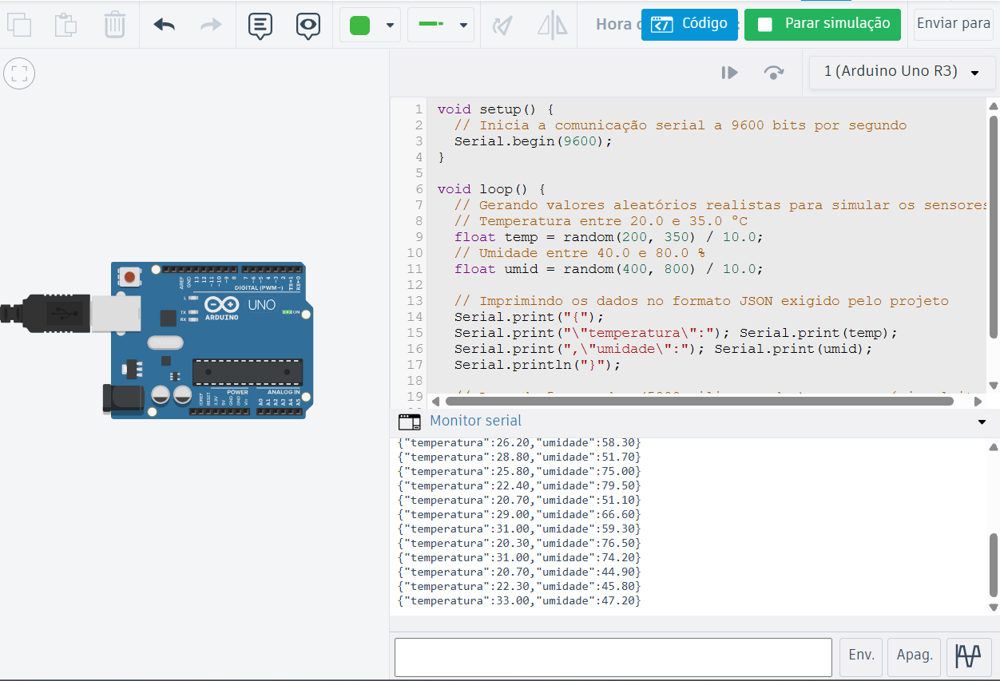

# Estação Meteorológica IoT

Sistema IoT com simulação de sensores (Arduino/Tinkercad), API **Flask**, persistência **SQLite** e interface web para visualização e **CRUD** das leituras.

O projeto inclui **`src/dados.db`** com leituras de exemplo (requisito de entrega: manter o arquivo com dados suficientes para demonstração).

## Visão geral

Fluxo ponta a ponta: firmware envia leituras em JSON; o backend recebe via API, grava no SQLite e expõe páginas HTML (dashboard, histórico, edição) além dos endpoints REST.


## Arquitetura

1. **Tinkercad / Arduino** — sketch em C++ gera temperatura e umidade simuladas e imprime **JSON** na serial (9600 baud, intervalo de 5 s). Circuito público: [simulação ingenious-fyyran-wolt](https://www.tinkercad.com/things/fLnvYbSOo9F-ingenious-fyyran-wolt).

2. **Ponte em Python** — o simulador no navegador não expõe porta COM ao PC; o script **`serial_reader.py`** envia os mesmos dados via **`POST /leituras`**, preservando o desenho da arquitetura até integração com hardware real.


## Firmware e pasta `arduino/`

| Caminho | Conteúdo |
|---------|----------|
| [`arduino/estacao.ino`](arduino/estacao.ino) | Sketch: serial 9600, leituras a cada 5 s, campos `temperatura` e `umidade` em JSON. |

### Monitor Serial (Tinkercad)

Com o sketch em execução no simulador, o Monitor Serial exibe uma linha JSON por leitura. A captura abaixo corresponde a essa saída e ao mesmo formato consumido pela API (via simulador Python ou futura ponte serial).

<p align="center">
  
</p>

**Formato de cada linha:**

```json
{"temperatura":25.4,"umidade":62.3}
```


## Estrutura em `src/`

| Item | Função |
|------|--------|
| `app.py` | Flask: rotas HTML, API REST. |
| `database.py` | Acesso ao SQLite (`dados.db`). |
| `serial_reader.py` | Cliente que simula envio periódico para `POST /leituras`. |
| `schema.sql` | DDL da tabela `leituras`. |
| `templates/` | `base.html`, `index.html`, `historico.html`, `editar.html`. |


## Instalação e execução

**Requisitos:** Python 3.10+.

```bash
python -m venv venv
# Windows: venv\Scripts\activate
# Linux/macOS: source venv/bin/activate

pip install -r requirements.txt
```

**Servidor (API + interface):**

```bash
cd src
python app.py
```

Navegador: [http://127.0.0.1:5000/](http://127.0.0.1:5000/)

**Simulador de leituras** (segundo terminal, com o venv ativo):

```bash
cd src
python serial_reader.py
```


## API REST

| Método | Rota | Descrição |
|--------|------|-----------|
| `GET` | `/` | Dashboard (HTML). |
| `GET` | `/historico` | Histórico (HTML). |
| `GET` | `/editar/<id>` | Formulário de edição (HTML). |
| `POST` | `/leituras` | Cria leitura (JSON). |
| `GET` | `/leituras` | Lista leituras (JSON). |
| `DELETE` | `/leituras/<id>` | Remove leitura. |
| `PUT` | `/leituras/<id>` | Atualiza temperatura/umidade. |

---

## Publicação no GitHub (branch `main`)

```bash
git add .
git commit -m "Entrega estação meteorológica IoT"
git branch -M main
git push -u origin main
```

Use a branch **`main`** (padrão no GitHub). Se o repositório local ainda estiver em `master`, `git branch -M main` renomeia para `main` antes do push.


